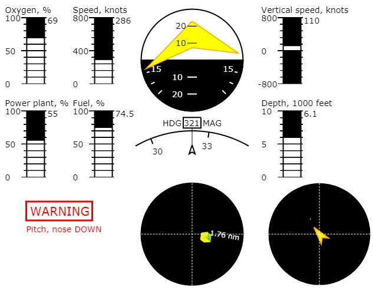
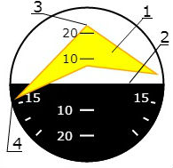
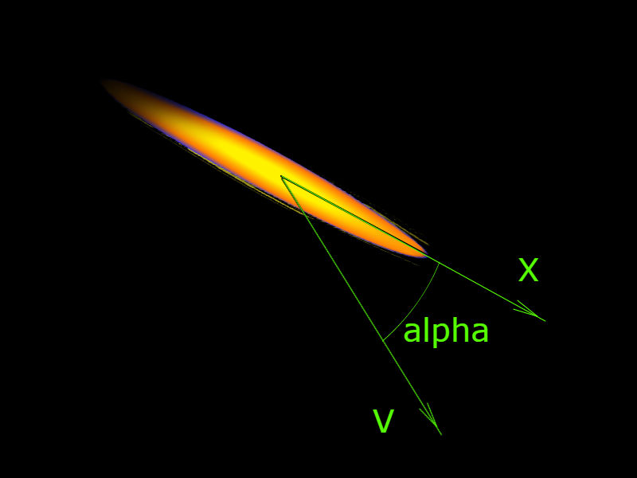
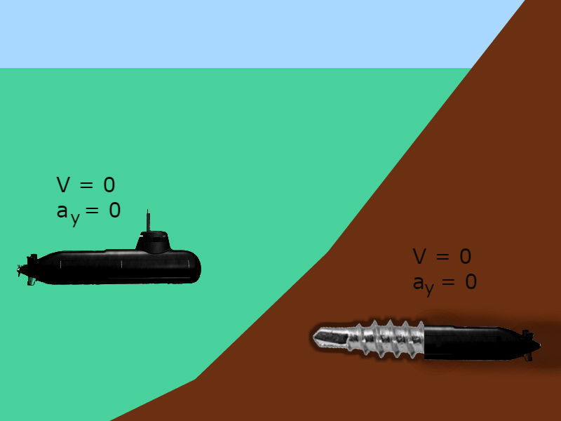
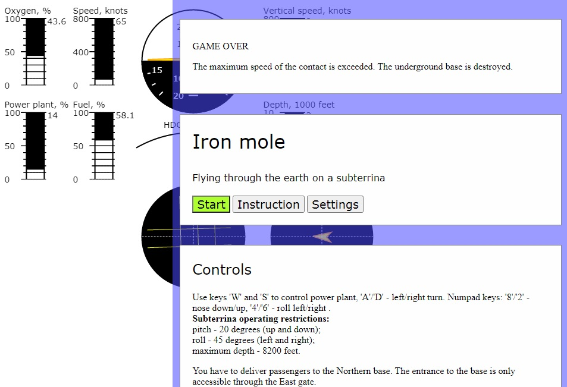

# subterrina
Simple javascript and HTML5's canvas 3D simulator game allowing you to be an iron mole driver. [View online](https://yeryomin1.github.io/subterrina/).

## Current features
* dashboard with indication of vehicle parameters:
  * roll, heading and pitch
  * power plant level 
  * speed
  * vertical speed
  * depth
  * oxygen reserve
  * fuel reserve
* warning signals with short instruction messages
* keyboard or mouse control  
Currently, only one mission is simulated. In this mission, the player docks at the Eastern gate of the Northern base.
## Controls
Two control modes of pitch and roll are supported.
### Mouse controls
* left/right - roll, left/right
* forward/backward - pitch, nose down/up
### Numpad controls
* '4'/'6' - roll, left/right
* '8'/'2' - pitch, nose down/up
### Common controls for both modes
* W/S: Increase/Decrease throttle
* A/D: Left/Right yaw
## Indicators
### Attitude
The artificial horizon indicator works on the principle of a fixed earth. This means that the horizon line (2) remains stationary while the vehicle symbol (1)rotates relative to it.

The indicator in the picture shows a pitch of about 22 degrees (3) and a left roll of slightly more than 10 degrees (4). If the pitch angle value (3) is less than zero, we will see the reverse side of the silhouette (1), which has a red color.
## Physics
Obviously, there are no exact models for the game. Currently, there is no source data for creating such models. However, we can make some assumptions:
1. The mole moves in the direction of its longitudinal axis, the values of the angles of attack and sideslip are negligible. Indeed, it would be strange to see the movement shown in the picture.

2. The vehicle does not need lift force, such as that of an airplane wing. This statement is less obvious than the first one. Let's say that the mole is more of a submarine than an airplane.

## Screenshots
### General
The game process as a whole looks like this.

### Game over
The top message contains a brief description of the accident circumstances.
